# ReadMe
Lily at Lily's 製 U#版 ドア開閉機構 DoorSystemのReadmeです。  
開閉動作は、プレイヤー間で同期します（あるプレイヤーがドアを開くと、他のプレイヤーのドアも開く）。  
以下、使用方法等について記載します。  

# 主要構成品
DoorSystem_by_Lily_v1.0.unitypackage  
DoorSystem  
├ DoorSystem.unity : ドア開閉機構テストシーン  
├ Animation : 各種ドア開閉テストアニメーション格納ディレクトリ  
└ DoorSystem_UdonProgramSources  
　 ├ LIS_SyncDoorController.cs : 手動開閉ドア 制御部 U#ソースコード  
　 ├ LIS_SyncDoorOpener.cs : 手動開閉ドア 開ボタン U#ソースコード  
　 ├ LIS_SyncDoorCloser.cs : 手動開閉ドア 閉ボタン U#ソースコード  
　 ├ LIS_SyncDoorTrigger.cs : 手動開自動閉ドア 制御部・開ボタン U#ソースコード  
　 └ LIS_SyncDoorSensor.cs : 自動開閉ドア 制御部・開エリア U#ソースコード

# 開発環境（動作確認環境）
- Unity 2018.4.20f1
- VRCSDK3-WORLD-2020.12.09.04.44_Public
- UdonSharp_v0.19.0

# 使い方
## Installation
VRChat公式からVRCSDK3-WORLDのunitypackage、  
及び、UdonSharpのunitypackageを以下githubからダウンロードしておいてください。  
[UdonSharp](https://github.com/MerlinVR/UdonSharp/releases, "https://github.com/MerlinVR/UdonSharp/releases")  
  
Unityで新規プロジェクト、または既存のVRChatワールドプロジェクトを開いてください。  
  
Assets->Import Package->Custom Packageから  
・VRCSDK3  
・UdonSharp  
をインポートしてください。Assets/UdonSharp/Examplesディレクトリは削除する必要があるかもしれません。  
上記2点は、既にインストール済みの場合、作業不要です。
  
その後、Assets->Import Package->Custom Packageから  
・DoorSystem_by_Lily_v1.0.unitypackage  
をインポートしてください。  
インストールは以上です。
  
## Sample Scene
HierarchyにDoorSystem.unityをドラッグ&ドロップしてください。  
サンプルシーンが使用できます。  
以下、各U#の使い方を記載しますが、  
サンプルシーンのオブジェクト構成も参考になると思います。  

---

## 手動開閉ドア (Sample Scene: SyncDoor1)
手動開閉ドアは以下のソースを使用します。  
・LIS_SyncDoorController.cs : 手動開閉ドア 制御部 U#ソースコード  
・LIS_SyncDoorOpener.cs : 手動開閉ドア 開ボタン U#ソースコード  
・LIS_SyncDoorCloser.cs : 手動開閉ドア 閉ボタン U#ソースコード  
  
- オブジェクト構成例  
  ドアヒンジ部（空GameObjectでよい。Animatorを適用する）  
  ├ ドアオブジェクト（ドア本体モデル）  
  └ 開閉コントローラ（空GameObjectでよい。UdonBehaviorを適用する）  
  　 ├ 開ボタン（ボタンが複数（ドアノブ表裏等）あれば複数用意。Collider、UdonBehaviorを適用する）  
  　 └ 閉ボタン（ボタンが複数（ドアノブ表裏等）あれば複数用意。Collider、UdonBehaviorを適用する）  
  
- Animator  
  開閉状態はAnimatorで制御します。  
  開閉手動制御の場合、  
  閉状態、閉→開遷移、開状態、開→閉遷移の4Animationを用意します。  
  bool変数"b_open"がtrueになると閉→開、falseになると開→閉で遷移します。
  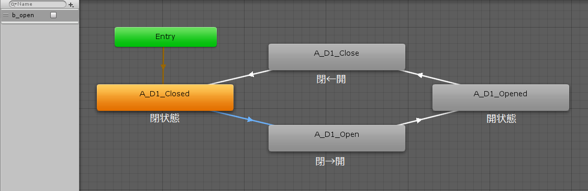  

  以下、設定を図解します。分かる人は飛ばして構いません。

  ■閉状態Animation  
  閉状態で1秒ループします。  
     
  Animationファイルを選択し、InspectorでLoopTimeのチェックが入っていることを確認してください。  
  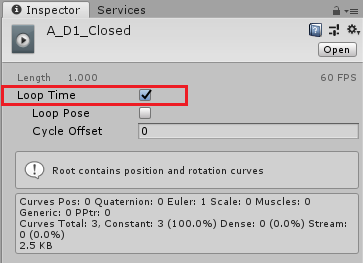  

  ■閉→開遷移Animation  
  閉状態から開状態へ遷移します。
  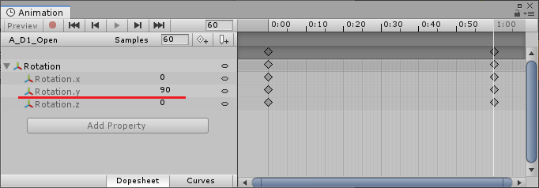   
  Animationファイルを選択し、InspectorでLoopTimeのチェックが外れていることを確認してください。  
  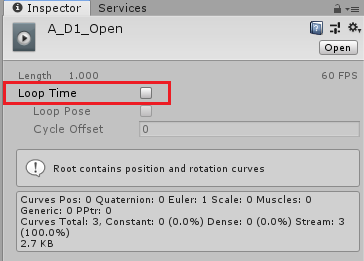  

  ■開状態Animation  
  開状態で1秒ループします。  
     
  Animationファイルを選択し、InspectorでLoopTimeのチェックが入っていることを確認してください。  
  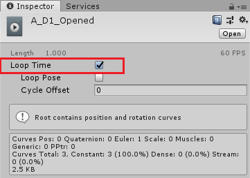  
  
  ■開→閉遷移Animation  
  開状態から閉状態へ遷移します。
  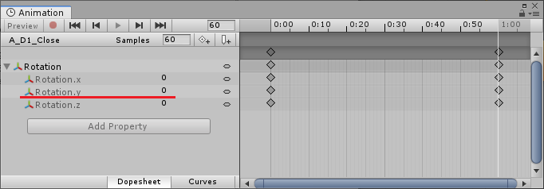   
  Animationファイルを選択し、InspectorでLoopTimeのチェックが外れていることを確認してください。  
  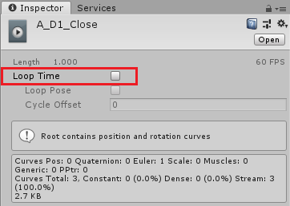  

  ■各Animation間のトランジション設定  
  遷移Animationへのトランジションは、HasExitTimeのチェックを外し、Conditionsにbool変数を設定します。  
  開・閉固定状態Animationへのトランジションは、HasExitTimeにチェックを入れておきます。  
  ExitTimeは1、TransitionDurationは0が良いと思います。  
    
  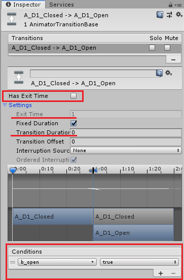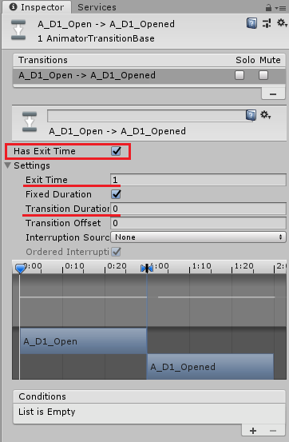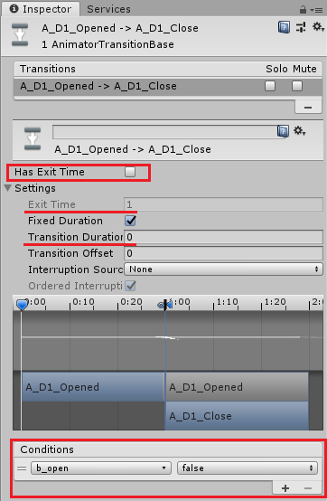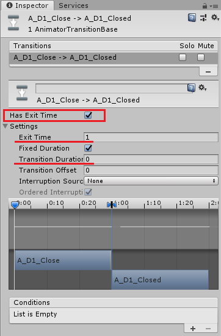  

### LIS_SyncDoorController  
開閉コントローラスクリプト  
ObjectにUdonBehaviorをアタッチし、LIS_SyncDoorController Udon C# Program Assetをセットしてください。  
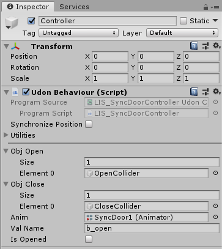  
- Obj Open: 開ボタンの指定
  - Size: 開ボタンの個数
  - Element n: 開ボタンオブジェクトの指定  
- Obj Close: 閉ボタンの指定
  - Size: 閉ボタンの個数
  - Element n: 閉ボタンオブジェクトの指定
- Anim: 開閉制御Animatorの指定（サンプルではドアヒンジ部にアタッチ）  
- Val Name: 開閉制御Animatorのbool変数名
- Is Opened: 開状態かどうか（開閉制御Animatorのbool変数の初期値）  
  
### LIS_SyncDoorOpener
開ボタンスクリプト（Warningは無視しています）  
ObjectにUdonBehaviorをアタッチし、LIS_SyncDoorOpener Udon C# Program Assetをセットしてください。  
合わせて、Colliderをアタッチしてください。IsTriggerにチェックを入れるのが良いと思います。  
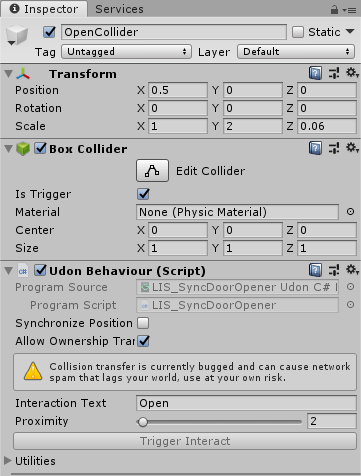  
- Interaction Text: カーソル時に表示されるワード
- Proximity: カーソル動作距離  

### LIS_SyncDoorCloser  
閉ボタンスクリプト（Warningは無視しています）  
ObjectにUdonBehaviorをアタッチし、LIS_SyncDoorCloser Udon C# Program Assetをセットしてください。  
合わせて、Colliderをアタッチしてください。IsTriggerにチェックを入れるのが良いと思います。  
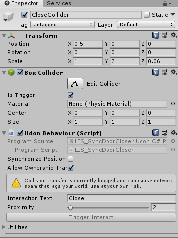  
- Interaction Text: カーソル時に表示されるワード
- Proximity: カーソル動作距離  

---

## 手動開自動閉（半自動）ドア (Sample Scene: SyncDoor2)
手動開自動閉（半自動）ドアは以下のソースを使用します。  
・LIS_SyncDoorTrigger.cs : 手動開自動閉ドア 制御部・開ボタン U#ソースコード  
  
- オブジェクト構成例  
  ドアヒンジ部（空GameObjectでよい。Animatorを適用する）  
  ├ ドアオブジェクト（ドア本体モデル）  
  └ 開ボタン（ボタンが複数（ドアノブ表裏等）あれば複数用意。Collider、UdonBehaviorを適用する）  
  
- Animator  
  開閉状態はAnimatorで制御します。  
  開のみ手動制御の場合、  
  閉状態、閉→開→閉遷移の2Animationを用意します。  
  （SyncDoor1で採用した4Animationで、開状態->開→閉遷移間トランジションをHasExitTimeで制御するのもアリだと思います。）  
  trigger変数"t_open"が発火すると、閉→開→閉で遷移します。  
  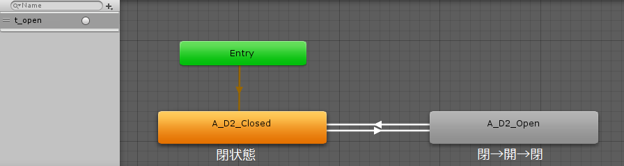  
  
  以下、設定を図解します。分かる人は飛ばして構いません。

  ■閉状態Animation  
  閉状態で1秒ループします。（サンプルではスライドドアの閉位置を指定しています。）  
  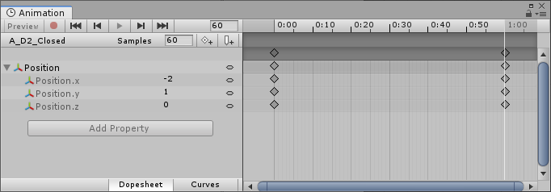   
  Animationファイルを選択し、InspectorでLoopTimeのチェックが入っていることを確認してください。  
  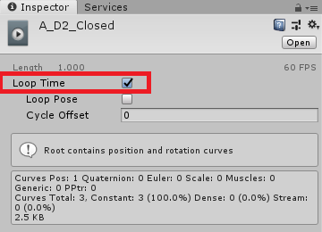  

  ■閉→開→閉遷移Animation  
  閉状態から開状態へ遷移、開状態を維持した後、再度開状態から閉状態へ遷移します。  
     
  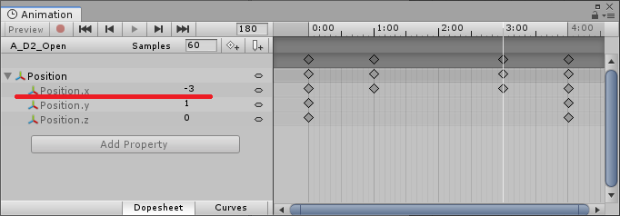   
  Animationファイルを選択し、InspectorでLoopTimeのチェックが外れていることを確認してください。  
  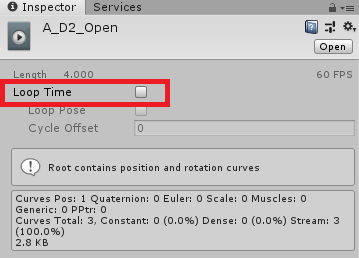  

  ■各Animation間のトランジション設定  
  遷移Animationへのトランジションは、HasExitTimeのチェックを外し、Conditionsにtrigger変数を設定します。  
  閉固定状態Animationへのトランジションは、HasExitTimeにチェックを入れておきます。  
  ExitTimeは1、TransitionDurationは0が良いと思います。  
    
  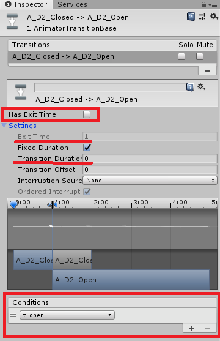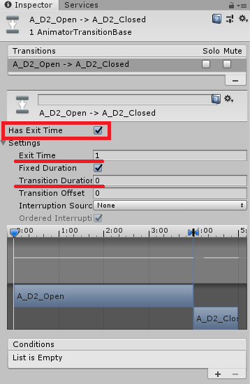  

### LIS_SyncDoorTrigger
開ボタンスクリプト（Warningは無視しています）  
ObjectにUdonBehaviorをアタッチし、LIS_SyncDoorTrigger Udon C# Program Assetをセットしてください。  
合わせて、Colliderをアタッチしてください。IsTriggerにチェックを入れるのが良いと思います。  
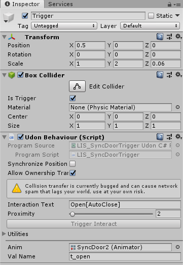  
- Interaction Text: カーソル時に表示されるワード
- Proximity: カーソル動作距離  
- Anim: 開閉制御Animatorの指定（サンプルではドアヒンジ部にアタッチ）  
- Val Name: 開閉制御Animatorのtrigger変数名  
  
開ボタン一つ一つに、LIS_SyncDoorTriggerを設定してください。  

---

## 自動開閉ドア (Sample Scene: SyncDoor3)
自動開閉ドアは以下のソースを使用します。  
・LIS_SyncDoorSensor.cs : 自動開閉ドア 制御部・開エリア U#ソースコード  

  
- オブジェクト構成例（両開きドア）  
  ドア管理部（空GameObjectでよい。Animatorを適用する）  
  ├ 右ドアヒンジ部（空GameObjectでよい）  
  │  └右ドアオブジェクト（ドア本体モデル）  
  ├ 右ドアヒンジ部（空GameObjectでよい）  
  │  └右ドアオブジェクト（ドア本体モデル）  
  └ 開エリア（Collider、UdonBehaviorを適用する）  

  ※複数の開エリアを設定するのは、動作未確認です。  

- Animator  
  開閉状態はAnimatorで制御します。  
  開閉自動制御の場合、  
  閉状態、閉→開遷移、開状態、開→閉遷移の4Animationを用意します。  
  int変数"i_open"が0より大きくなると閉→開、0になると開→閉で遷移します。
  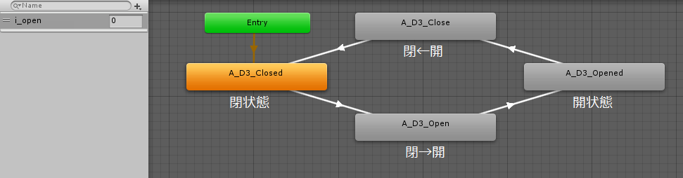  

  以下、設定を図解します。分かる人は飛ばして構いません。
  
  各状態のAnimationは、SyncDoor1と同様の設定です。  
  両開きの例として、閉→開遷移Animationのみ図示します。  

  ■閉→開遷移Animation  
  閉状態から開状態へ遷移します。
  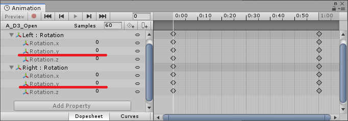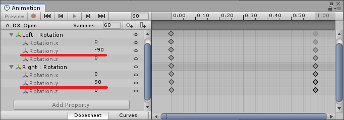   
  Animationファイルを選択し、InspectorでLoopTimeのチェックが外れていることを確認してください。  

  ■各Animation間のトランジション設定  
  遷移Animationへのトランジションは、HasExitTimeのチェックを外し、Conditionsにbool変数を設定します。  
  開・閉固定状態Animationへのトランジションは、HasExitTimeにチェックを入れておきます。  
  ExitTimeは1、TransitionDurationは0が良いと思います。  
    
  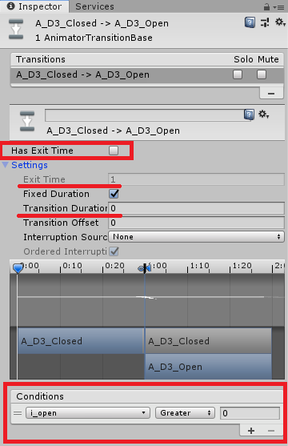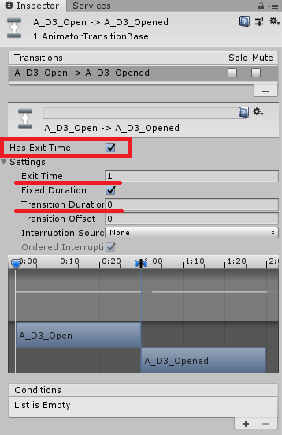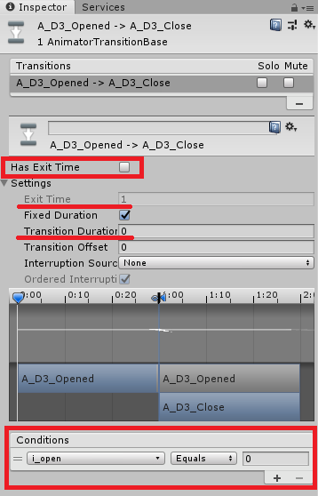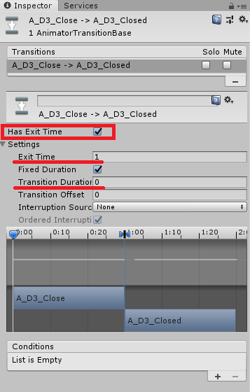  

### LIS_SyncDoorSensor
開エリアスクリプト（Warningは無視しています）  
ObjectにUdonBehaviorをアタッチし、LIS_SyncDoorSensor Udon C# Program Assetをセットしてください。  
合わせて、Colliderをアタッチしてください。IsTriggerにチェックを入れてください。  
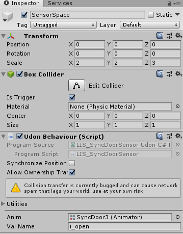  
- Anim: 開閉制御Animatorの指定（サンプルではドア管理部にアタッチ）  
- Val Name: 開閉制御Animatorのint変数名  

# バージョン情報
- v1.0 : 2020/02/07 初回リリース
  
# 著作権表示・ライセンス
Copyright 2021 Lily at Lily's  
  
本頒布品におけるLilyの著作物は、MITライセンスで提供しています。